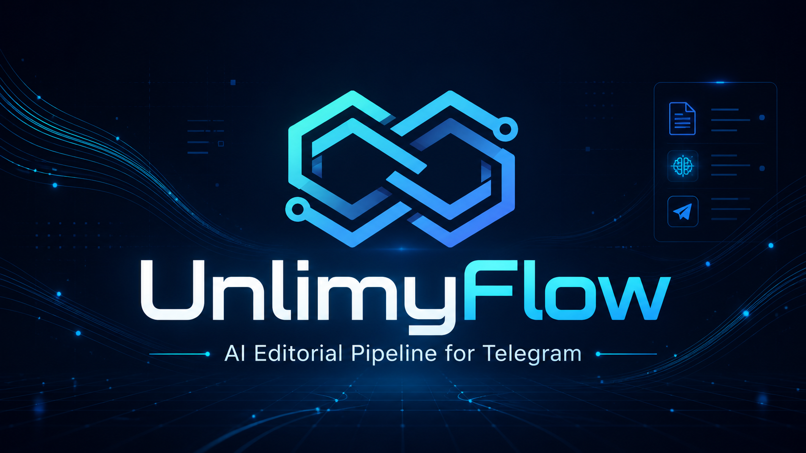

# unlimyFlow

[](https://github.com/unlimy-org/unlimy-flow/actions/workflows/ci.yml)
[](https://github.com/unlimy-org/unlimy-flow/actions/workflows/cd.yml)




Telegram-бот для редакционного пайплайна Unlimy: принимает новость, генерирует пост, валидирует, отправляет на модерацию, публикует сразу или по расписанию.

## Возможности
- LLM-пайплайн: `generate -> rule-based validation -> critic pass`.
- Очистка пересланных сообщений от рекламных/ссылочных хвостов.
- Режимы публикации:
  - `instant` — публикация сразу в канал.
  - `queue` — предпросмотр и модерация.
- Модерация через inline-кнопки:
  - Опубликовать сейчас
  - Перегенерировать
  - Запланировать (интервалы + выбор дня/времени)
  - Отмена
- Фоновый воркер отложенных публикаций.
- Команда `/scheduled` для просмотра и отмены запланированных постов.
- PostgreSQL для истории и очередей.
- Redis для временных ключей, флагов и счётчиков.

## Структура проекта
- `main.py` — точка входа, wiring зависимостей, scheduled worker.
- `handlers.py` — команды, сообщения, callback-сценарии.
- `llm.py` — генерация, валидация, критик.
- `formatter.py` — финальный рендер поста под Telegram HTML.
- `db.py` — слой доступа к PostgreSQL.
- `redis_client.py` — слой доступа к Redis.
- `cleaner.py` — очистка текста форвардов.
- `keyboards.py` — inline-клавиатуры.
- `config.py` — конфиг из переменных окружения.

## Локальный запуск
1. Установите зависимости:
```bash
python -m venv .venv
source .venv/bin/activate  # Windows: .venv\Scripts\activate
pip install -r requirements.txt
```
2. Поднимите локальные сервисы:
```bash
docker compose up -d
```
3. Создайте `.env`:
```bash
cp .env.example .env
```
4. Запустите бота:
```bash
python main.py
```

## Обязательные переменные окружения
- `BOT_TOKEN`
- `OWNER_ID`
- `CHANNEL_ID`
- `OPENAI_API_KEY`
- `PG_DSN`
- `REDIS_URL`

Дополнительно:
- `OPENAI_MODEL`
- `OPENAI_MODEL_CRITIC`
- `TEMPERATURE_GENERATOR`
- `TEMPERATURE_CRITIC`
- `MAX_TOKENS_GENERATOR`
- `MAX_TOKENS_CRITIC`
- `MAX_RETRIES`
- `PUBLISH_MODE`
- `CUSTOM_STAR_EMOJI_ID`

## Команды бота
- `/start`
- `/help`
- `/mode`
- `/status`
- `/history`
- `/scheduled`

## Деплой на VPS (production)
1. Клонируйте репозиторий:
```bash
git clone <repo-url> ~/unlimyFlow
cd ~/unlimyFlow
```
2. Подготовьте env:
```bash
cp deploy/.env.prod.example .env.prod
```
3. Запустите стек:
```bash
docker compose -f deploy/docker-compose.prod.yml --env-file .env.prod up -d --build
```

## Деплой staging
```bash
cp deploy/.env.staging.example .env.staging
docker compose -f deploy/docker-compose.staging.yml --env-file .env.staging up -d --build
```

## CI/CD
- CI: `.github/workflows/ci.yml`
  - установка зависимостей
  - проверка синтаксиса (`compileall`)
- CD: `.github/workflows/cd.yml`
  - деплой по SSH на VPS при push в `main`

Secrets для GitHub:
- `VPS_HOST`
- `VPS_USER`
- `VPS_SSH_KEY`
- `VPS_PORT` (опционально)
- `VPS_APP_DIR` (опционально)

## Полезные команды
```bash
docker compose -f deploy/docker-compose.prod.yml --env-file .env.prod ps
docker compose -f deploy/docker-compose.prod.yml --env-file .env.prod logs -f bot
```

